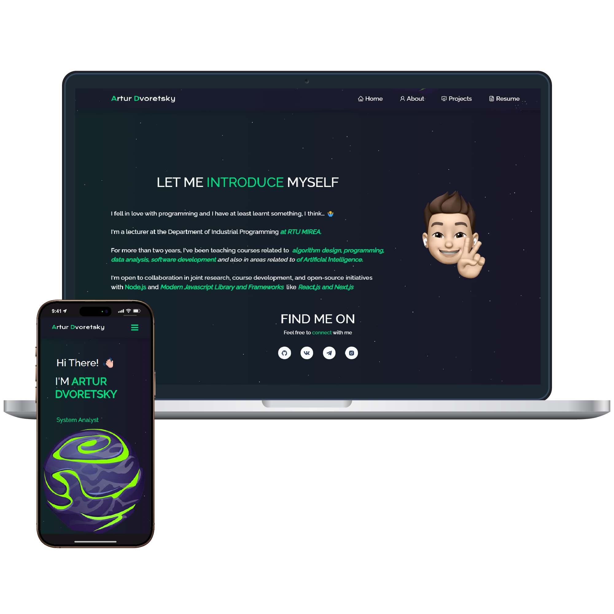

<h2 align="center">
  🌐 Portfolio Website — dv0retsky
</h2>

<div align="center">
  
</div>

<br/>

<div align="center">

[](https://forthebadge.com) &nbsp;
[](https://forthebadge.com)

</div>

---

## 🚀 About the Project

This portfolio website is designed as a clean, multi-page layout for showcasing personal projects, skills, and experience.  
It can be used as a reference or inspiration for your own portfolio development.  
Includes a sample resume section and pre-configured technical skills.

---

## 🛠 Built With

This project leverages a modern full-stack JavaScript ecosystem:

- **React.js** – Frontend library for building interactive UIs  
- **Node.js** – Runtime environment for backend logic  
- **Express.js** – Minimal and flexible Node.js framework  
- **CSS3** – Styling and animations  
- **React-Bootstrap** – Ready-to-use styled components  
---

## ✨ Features

- **📖 Multi-Page Layout** — Clean navigation across sections  
- **🎨 Easy Customization** — Styled with CSS and React-Bootstrap  
- **📱 Fully Responsive** — Works seamlessly on mobile, tablet, and desktop  

---

## ⚡ Getting Started

To run this project locally, ensure you have **Node.js** and **Git** installed.

### 1️⃣ Clone the repository

```bash
git clone https://github.com/dv0retsky/portfolio-dv0retsky.git
```

### 2️⃣ Navigate to project folder

```bash
cd portfolio-dv0retsky
```

### 3️⃣ Install dependencies

```bash
npm install
```

### 4️⃣ Start the development server

```bash
npm start
```

The app will be available at http://localhost:3000.   
The page reloads automatically when you make changes.

### 🖋 Usage Instructions
1. Open the project folder and go to:

```bash
/src/components/
```

2. Update the component files with your own information (name, projects, skills, etc.).

3. Customize styles as needed in CSS files or through React-Bootstrap.

---

<div align="center"> Made with ❤️ by <b>dv0retsky</b> </div>
